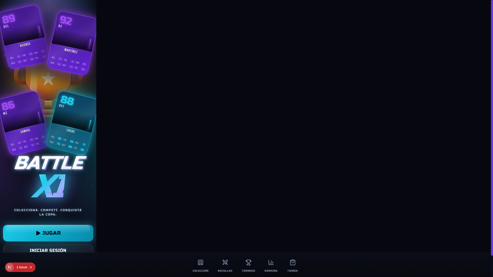

# Battle XI

> **Tus figuritas cobran vida.**
> Escaneá una figurita física, transformala en una carta digital única con IA, potenciala y conquistá la copa.



---

## Qué es

**Battle XI** es una WebApp mobile-first para chicos de 7 a 14 años donde:

1. Escanean una figurita física con la cámara del celular.
2. Una IA generativa transforma la figurita en una carta digital exclusiva.
3. Coleccionan, potencian y arman su equipo.
4. Compiten en batallas y torneos para conquistar la copa.

**Promesa emocional**: *“Este jugador es mío. Lo puedo mejorar. Quiero usarlo para ganar.”*

---

## Arquitectura

```
┌─────────────────────┐     ┌──────────────────────┐     ┌────────────────────┐
│      Vercel         │     │      Railway         │     │  Servicios IA       │
│  Next.js 16 (App)   │────▶│  Postgres + API      │────▶│  Replicate (Flux)   │
│  React 19           │     │  (jobs IA, OCR)      │     │  Cloudinary (storage)│
└─────────────────────┘     └──────────────────────┘     └────────────────────┘
        ▲                            ▲
        │                            │
        └────── Cliente (browser) ───┘
                Validación CV + OCR
                (face-api / OpenCV / Tesseract)
```

### Frontend · Vercel
- **Next.js 16** (App Router) + **React 19**
- **Tailwind CSS v4** con sistema de design tokens propio
- **Motion (Framer Motion v12)** para animaciones
- **Lucide React** para íconos
- **Manrope · Russo One · Bebas Neue** como sistema tipográfico

### Backend · Railway
- **Postgres** para datos del juego (usuarios, cartas, batallas, ranking)
- API REST en Next.js Route Handlers (MVP) → migrable a servicio Node dedicado cuando escale
- Procesamiento pesado en background (workers separados)

### Pipeline de escaneo
```
Foto del chico
   │
   ▼
[Validación client-side]
   ├─ OpenCV.js · detecta rectángulo de figurita
   ├─ face-api.js · valida que haya un rostro
   ├─ Tesseract.js · OCR (nombre, club, fecha)
   └─ Score de confianza ≥ 70/100
   │
   ▼  (si pasa)
[POST /api/scan]
   │
   ▼
[Server-side]
   ├─ Recorte de rostro
   ├─ Replicate · Flux Schnell · genera ilustración
   ├─ Composición de carta (canvas/satori)
   ├─ Upload a Cloudinary
   └─ Insert en DB
   │
   ▼
[Reveal de carta al chico]
```

---

## Sistema visual

Toda la dirección visual nace de la imagen de referencia: estadio nocturno, neón cyan/violeta, copa dorada central, cartas épicas en las esquinas.

### Paleta de colores
| Uso | Color | Hex |
|-----|-------|-----|
| Fondo profundo | Negro estadio | `#03040c` |
| Acción / energía | Cyan eléctrico | `#22d3ee` |
| Batalla / élite | Violeta neón | `#a855f7` |
| Premio / leyenda | Dorado | `#fbbf24` |
| Texto principal | Blanco off | `#f8fafc` |

### Sistema de rarezas
| Rareza | Color | Uso |
|---|---|---|
| `common` (Básica) | Gris azulado | Cartas iniciales |
| `pro` | Cyan | Mejorables |
| `rare` | Azul brillante | Premio común de batalla |
| `elite` | Violeta | Premio fuerte |
| `champion` | Ámbar | Cartas top |
| `legend` | Dorado animado | Cartas únicas/raras |

### Tipografía
- **Russo One** (display) — títulos, botones, ratings
- **Bebas Neue** (sport) — stats, etiquetas
- **Manrope** (body) — texto general
- **JetBrains Mono** (mono) — números/datos

---

## Estructura del proyecto

```
.
├── public/                  # Assets estáticos
├── src/
│   ├── app/                 # Páginas (App Router)
│   │   ├── page.tsx         # Home pública
│   │   ├── login/           # Onboarding
│   │   ├── jugar/           # Home logueado
│   │   ├── escanear/        # Captura de figurita
│   │   ├── coleccion/       # Mi colección
│   │   ├── batallas/        # Modos de combate
│   │   ├── torneos/         # Copas
│   │   ├── ranking/         # Tabla de líderes
│   │   └── tienda/          # Sobres y mejoras (gemas)
│   ├── components/
│   │   ├── BattleLogo.tsx   # Logo BATTLE XI
│   │   ├── Trophy3D.tsx     # Copa dorada SVG
│   │   ├── PlayerCard.tsx   # Carta de jugador (todas las rarezas)
│   │   ├── Button.tsx       # Botones (cyan/violet/gold/ghost/outline)
│   │   ├── BottomNav.tsx    # Navegación inferior
│   │   └── PageShell.tsx    # Layout interno con header
│   └── lib/
│       ├── cn.ts            # Helper de classnames
│       └── rarity.ts        # Sistema de rarezas
└── screenshots/             # Capturas de referencia
```

---

## Desarrollo local

### Requisitos
- Node.js ≥ 20
- npm ≥ 10

### Instalación

```bash
npm install
cp .env.example .env.local   # completar con tus tokens
npm run dev
```

App corriendo en `http://localhost:3000`.

### Comandos

| Comando | Acción |
|---|---|
| `npm run dev` | Servidor de desarrollo con hot reload |
| `npm run build` | Build de producción |
| `npm start` | Servidor de producción |

---

## Rutas implementadas (MVP visual)

| Ruta | Estado | Descripción |
|---|---|---|
| `/` | ✅ | Home pública con copa, cartas flotantes y CTA |
| `/login` | ✅ | Onboarding (apodo + email del adulto) |
| `/jugar` | ✅ | Dashboard del jugador logueado |
| `/escanear` | ✅ | UI de cámara con marco y línea de escaneo animada |
| `/coleccion` | ✅ | Grilla de cartas con filtros |
| `/batallas` | ✅ | Modos de combate (Rápida / Reto / Equipo vs Equipo) |
| `/torneos` | ✅ | Copas activas con premios |
| `/ranking` | ✅ | Top global con podio y lista |
| `/tienda` | ✅ | Sobres y mejoras (gemas, sin dinero real) |

---

## Roadmap

### Fase 1 — Sistema visual + UI estática ✅
- [x] Design tokens y componentes base
- [x] Las 9 pantallas principales con datos mock
- [x] Carta de jugador con sistema de rarezas

### Fase 2 — Auth + DB (en curso)
- [ ] Schema de Postgres en Railway (users, cards, battles)
- [ ] Auth con sesión cookie
- [ ] Persistencia de colección

### Fase 3 — Escaneo real
- [ ] Validación client-side (OpenCV + face-api + Tesseract)
- [ ] Endpoint `/api/scan` con integración Replicate
- [ ] Reveal animado de carta generada

### Fase 4 — Mecánicas de juego
- [ ] Sistema de stats y mejora con XP
- [ ] Batalla por comparación de stats
- [ ] Economía de gemas + energía
- [ ] Ranking y torneos con backend

### Fase 5 — Deploy
- [ ] Vercel (frontend)
- [ ] Railway (Postgres + workers)
- [ ] Cloudinary (storage de cartas generadas)

---

## Identidad

- **Nombre**: Battle XI
- **Tagline**: *Coleccioná. Competí. Conquistá la copa.*
- **Tono**: épico, gamer, juvenil, jamás infantil ni serio.

---

## Notas legales importantes

- **No usamos** marcas, logos, escudos o imágenes oficiales de Panini, FIFA, ligas, federaciones, clubes ni jugadores reales.
- La imagen original de la figurita escaneada **nunca se guarda**. Solo se conserva la ilustración generada por IA, que constituye una obra derivativa estilizada.
- El reconocimiento ocurre client-side; los datos del jugador (nombre, fecha de nacimiento) se usan solo para etiquetar la carta del usuario y no se exponen públicamente.

---

## Estado actual

**v0.1 · Sistema visual completo + las 9 pantallas con datos mock corriendo localmente.**

Próximo paso: backend en Railway + integración con Replicate para el pipeline de escaneo.
